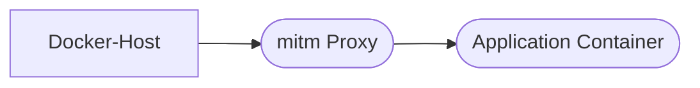

# mitm-nginx-proxy-companion

A mashup of [mitmproxy](https://github.com/mitmproxy/mitmproxy) and [jderusse/docker-dns-gen](https://github.com/jderusse/docker-dns-gen)

[](https://hub.docker.com/r/hypery2k/mitm-nginx-proxy-companion)

> **Why**
> - So you can have a dockerized replacement of [Telerik Fiddler](https://www.telerik.com/fiddler)
> - So you can do "one time browser proxy plugin setup" instead of "continious editing of `/etc/hosts`" when developing web resources
> - So you can mock resources selectively in a managable way
> - So you can inspect intermediate pings/hops of redirects
> - So you can use your production [nginx-proxy/nginx-proxy](https://github.com/nginx-proxy/nginx-proxy)-based setup localy



# Requirements

- Set container dns to `127.0.0.1`
- Mount `docker.sock`
- Reverse proxy container with `mitmproxy.proxyVirtualHosts=true` label


# Usage

```
version: '3'

services:

  nginx-proxy-mitm:
    image: hypery2k/mitm-nginx-proxy-companion
    ports:
      - "8080:8080"
      # Can be used to access mitm web interface
      - "8081:8081"
    dns:
      - 127.0.0.1
    volumes:
      - /var/run/docker.sock:/var/run/docker.sock:ro

  nginx-proxy:
    image: nginxproxy/nginx-proxy:latest
    labels:
      - "mitmproxy.proxyVirtualHosts=true"
    volumes:
      - /var/run/docker.sock:/tmp/docker.sock:ro

  example-one:
    environment:
      VIRTUAL_HOST: example-one.com
    image: nginx:alpine
```

- Run `docker-compose up`
- Add a proxy extension to your browser, with proxy address being `127.0.0.1:8080`
- Access `http://example-one.com`
